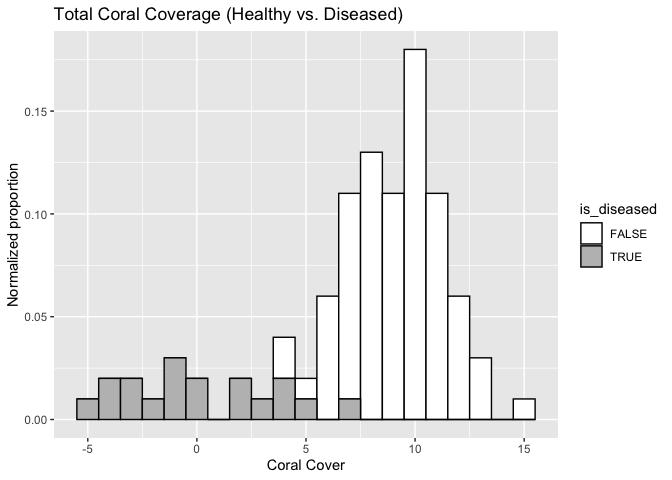
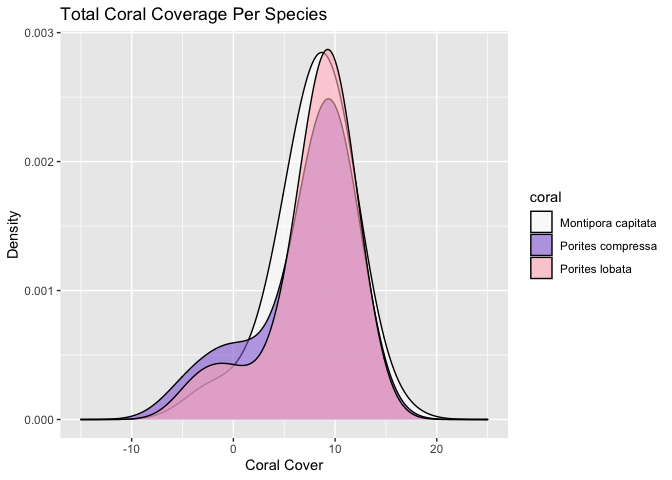

Apply Functions Experience MBIO 612
================
Kathryn Van Artsdalen
2022-09-20

``` r
# Write you library imports here. E.g.:
library(ggplot2)
library(tidyverse)
```

    ## ── Attaching packages ─────────────────────────────────────── tidyverse 1.3.2 ──
    ## ✔ tibble  3.1.8      ✔ dplyr   1.0.10
    ## ✔ tidyr   1.2.0      ✔ stringr 1.4.1 
    ## ✔ readr   2.1.2      ✔ forcats 0.5.2 
    ## ✔ purrr   0.3.4      
    ## ── Conflicts ────────────────────────────────────────── tidyverse_conflicts() ──
    ## ✖ dplyr::filter() masks stats::filter()
    ## ✖ dplyr::lag()    masks stats::lag()

``` r
library(assertthat)
```

    ## 
    ## Attaching package: 'assertthat'
    ## 
    ## The following object is masked from 'package:tibble':
    ## 
    ##     has_name

### Instructions:

1.  it is considered proper programming practice to load all the
    libraries you need in the first cell of a notebook or at the top of
    the R-Markdown file. Put all your imports (e.g., `library(ggplot)`)
    in the cell above.
2.  Create as many cells as needed to answer a question

-   Group code that is logically related in the same cell
-   Keep cells relatively small
-   Format long statements or expressions, including `ggplot`, across
    multiple lines

3.  Submit your work to GitHub under your MBIO repository.

-   Folder should be called `4_apply_and_data`

### Q1

-   Write a function called `sd_x` that computes the standard deviation
    from first principles. Recall that the standard deviation is
    computed as

$$
\sigma = \sqrt{\frac{\sum{(x_i - \mu)^2}}{N-1}}
$$

-   $\mu$ is simply the mean of the vector of inputs
    -   it can be computed using the `mean` function

For example, given:

`x = c(1,2,3)`

Since $\mu = 2$, then
$\sigma = \sqrt{\frac{(1-2)^2 + (2-2)^2 + (3-2)^2}{3}} = 1$.

``` r
# Write your code here
# use extra cells if needed
x <- c(1:10) # example vector 
sd <- sqrt((sum((x - mean(x))^2)) / (length(x) - 1)) # my sd function
```

### Optional Question

Remember that we cannot compute the standard deviation of a single
value. As such, modify your `sd_x` code to throw an error similar to
those R generates when your code contains an error, whenever a user
calls `sd_x` with a list containing a single element. Various methods
can be used to accomplish this. One such way is by using the
[`assertthat` package](https://github.com/hadley/assertthat)

``` r
# Write your code here if you choose to answer the question above
# use extra cells if needed
assert_that(length(x) > 1) # will give error message if vector has length 1
```

    ## [1] TRUE

### Q2

Given the following matrix of data where each column consists of a
variable: 1. Convert this data frame into a tibble called data_tbl 2.
Use one of the apply-type of functions in conjunction with `sd_x` you
wrote previously to compute the standard deviation for each column.

``` r
data = matrix(1:50, ncol=5)
colnames(data) = c("variable_1", "variable_2", "variable_3", "variable_4", "variable_5")
data
```

    ##       variable_1 variable_2 variable_3 variable_4 variable_5
    ##  [1,]          1         11         21         31         41
    ##  [2,]          2         12         22         32         42
    ##  [3,]          3         13         23         33         43
    ##  [4,]          4         14         24         34         44
    ##  [5,]          5         15         25         35         45
    ##  [6,]          6         16         26         36         46
    ##  [7,]          7         17         27         37         47
    ##  [8,]          8         18         28         38         48
    ##  [9,]          9         19         29         39         49
    ## [10,]         10         20         30         40         50

``` r
# Write your code here
# use extra cells if needed
# convert data to tibble
data_tbl <- tibble(data)
data_tbl
```

    ## # A tibble: 10 × 1
    ##    data[,"variable_1"] [,"variable_2"] [,"variable_3"] [,"variable_4"] [,"vari…¹
    ##                  <int>           <int>           <int>           <int>     <int>
    ##  1                   1              11              21              31        41
    ##  2                   2              12              22              32        42
    ##  3                   3              13              23              33        43
    ##  4                   4              14              24              34        44
    ##  5                   5              15              25              35        45
    ##  6                   6              16              26              36        46
    ##  7                   7              17              27              37        47
    ##  8                   8              18              28              38        48
    ##  9                   9              19              29              39        49
    ## 10                  10              20              30              40        50
    ## # … with abbreviated variable name ¹​[,"variable_5"]

``` r
# compute st dev for each column
print(apply(data_tbl, 2, sd))
```

    ## data.variable_1 data.variable_2 data.variable_3 data.variable_4 data.variable_5 
    ##         3.02765         3.02765         3.02765         3.02765         3.02765

### Q3

-   In this question, we will build a simulated dataset for healthy and
    diseased corals. You will be creating a `tibble` called
    `coral_health_tbl` that contains 2 columns:

1.  A column called `coral`. Generate this column by sampling 100 coral
    species from the following values

``` r
coral_pop = c("Montipora capitata",
  "Porites compressa",
  "Porites lobata")
```

-   You can use the function `sample` to select 100 values from the
    vector `coral_pop`
    -   You can see how the function sample works
        [here](https://www.rdocumentation.org/packages/base/versions/3.6.2/topics/sample)

2.  The second column is called `is_diseased`.
    -   it represents 100 randomly selected `TRUE` or `FALSE` values
        that represent whether the coral is healthy or diseased.
    -   Healthy corals (`is_diseased == FALSE`; not diseased) occur with
        a probability of 0.8, i.e. (`is_diseased == TRUE`) occurs with a
        probability of 0.2

``` r
# Write your code here
# use extra cells if needed

# sampling 100 coral to make coral column
coral <- sample(coral_pop, 100, replace = TRUE)

# probability of being diseased or not diseased
is_diseased <- sample(c(TRUE,FALSE), 100, replace = TRUE, prob = c(0.2, 0.8))

# creating coral health tibble
coral_health_tbl <- tibble(coral, is_diseased)
head(coral_health_tbl)
```

    ## # A tibble: 6 × 2
    ##   coral              is_diseased
    ##   <chr>              <lgl>      
    ## 1 Montipora capitata FALSE      
    ## 2 Porites compressa  FALSE      
    ## 3 Porites lobata     TRUE       
    ## 4 Porites compressa  TRUE       
    ## 5 Porites lobata     FALSE      
    ## 6 Montipora capitata FALSE

### Q4

-   The function `rnorm` is used to sample (i.e., produce) random values
    from a normal distribution. The syntax of the function is as
    follows:

<!-- -->

    rnorm(n, mu, sd)

where n is the number of samples to generate, mu is the mean of the
distribution and `sd` is the standard deviation.

Essentially what the function does is generate `n` random values from a
normal distribution that is centered around the mean `mu` and has the
standard deviation defined by the parameter `sd`. If you do not
understand what this statement means, you should not worry as we will
cover it in greater detail in the next section. However, you must know
that this function generates n random values that are in some way close
to the provided mean (`mu`) you provided.

Use the cell below to experiment with the function `rnorm`. E.g.: try to
generate 5 values from the distribution with a mean 10 and a standard
deviation 1.

``` r
# Write your code here
# use extra cells if needed

# rnorm with 5 numbers, mean 10, sd 1
z <- rnorm(5, 10, 1)
mean(z)
```

    ## [1] 10.08606

``` r
sd(z)
```

    ## [1] 1.856216

``` r
# also trying rnorm distribution with a large sample size, mean 10, sd 1
my_rnorm <- rnorm(500, 10, 1)
# generating 5 values from the distribution with about mean 10 and sd 1
y <- sample(my_rnorm, 5)
mean(y)
```

    ## [1] 9.927463

``` r
sd(y)
```

    ## [1] 0.5922447

### Q5

-   Create a new column in `coral_health_tbl` called `coral_cover`. This
    column represents coral cover values for the corals observed in your
    tibble
-   For the healthy coral (`is_diseased == FALSE`), sample the cover
    values from a normal with a mean of 9 and standard deviation of 2
-   For the diseased corals (`health_status = TRUE`), sample the cover
    values from a normal with mean 1 and std of 3
-   Note that this is a perfect scenario for using `mapply`

``` r
# Write your code here
# use extra cells if needed

# generating function to determine coral cover by sampling from different distributions depending on if coral is healthy or diseased
generate_cover_function <- function(x){
  if(x == FALSE){
    rnorm(1, mean = 9, sd = 2) 
  } else {
    rnorm(1, mean = 1, sd = 3) 
  }
}

# creating coral cover column 
coral_health_tbl$coral_cover <- mapply(generate_cover_function, coral_health_tbl$is_diseased)
```

### Q6

-   Add another column called `binary_health_status`.

-   set the column to 0 if `is_diseased == FALSE`

-   set the column to 1 if `is_diseased == TRUE`

-   A trick here is to remember that:

    1.  Corecing (converting) a logical can be done with `as.integer()`
    2.  `as.integer(TRUE)` returns 1
    3.  `as.integer(FALSE)` returns 0

``` r
# adding column with binary health status so TRUE = 1, FALSE = 0
coral_health_tbl$binary_health_status <- as.integer(coral_health_tbl$is_diseased)
head(coral_health_tbl)
```

    ## # A tibble: 6 × 4
    ##   coral              is_diseased coral_cover binary_health_status
    ##   <chr>              <lgl>             <dbl>                <int>
    ## 1 Montipora capitata FALSE            10.5                      0
    ## 2 Porites compressa  FALSE             8.49                     0
    ## 3 Porites lobata     TRUE              5.17                     1
    ## 4 Porites compressa  TRUE             -0.683                    1
    ## 5 Porites lobata     FALSE            12.7                      0
    ## 6 Montipora capitata FALSE             8.04                     0

### Q7

-   Plot the distribution of `coral_cover` for healthy versus diseased
    corals
-   Note that I am using the histogram `geom`
    -   Histograms need only an `x`-axis because the `y` is typically
        computed as the number of items occurring in a bin of some
        predetermined width.
        -   However, instead of a raw count, we want a normalized count.
            You can normalize the count by setting
            `y = stat(count / sum(count))`  
    -   I am coloring the bin outlines in black and filling in grey for
        disease and white for healthy
    -   I am using \`binwidth=1’.
-   Use the `labs` function to add a title and to change the labels for
    the `x` and `y` axes
-   The plot should look “somewhat” like the following
    

``` r
# creating histogram plot of proportion of coral cover that is healthy vs. diseased
ggplot(coral_health_tbl, aes(x = coral_cover, y = stat(count / sum(count)), fill = is_diseased))+
  geom_histogram(binwidth = 1, color = "black")+
  scale_fill_manual(values = c("white", "grey"))+
  xlab("Coral Cover")+
  ylab("Normalized proportion")+
  labs(title = "Total Coral Coverage (Healthy vs. Diseased)")
```

<!-- -->

### Q8

-   Use `geom_density` to mirror the information conveyed in the
    histogram above using density curves instead of histograms.
    -   Set the `adjust` parameter of `geom_density` to `2`
-   Change the `xlim` scale so that we can see the edges of the curves
    -   I.e., curves should not be cut off
-   The resulting curve will look like the following
    

``` r
# creating density curves to show proportion of coral cover that is healthy vs. diseased
ggplot(coral_health_tbl, aes(x = coral_cover, y = stat(count / sum(count)), fill = coral))+
  geom_density(adjust = 2, color = "black", alpha = 0.6)+
  scale_fill_manual(values = c("white", "mediumpurple", "lightpink"))+
  xlim(-15, 25)+
  xlab("Coral Cover")+
  ylab("Density")+
  labs(title = "Total Coral Coverage Per Species")
```

<!-- -->

### Q9

You have been provided with the dataset illustrated in the image below,
which contains counts for 20 fish species across 5 locations. For
convenience, only two species and 2 locations are illustrated here.
Based on your knowledge of tidy data, how can you format the data shown
in this file in a way that is considered `tidy`. Provide an image of a
hand-drawn table (or tables if needed) that represents the table format.
Briefly justify your answer in a 3-4 sentences.


### Kathryn’s Tidy Fish Dataset


In tidy data, each variable forms a column, each observation forms a
row, and each type of observational unit forms a table. We have one
observational unit (fish species) that we are collecting data about so
we have one table. We need to consolidate the locations into a column.
Columns must all be variables and we have one variable per column
(Genus/species name, common name, location, and count). Each observation
is a row (the frequency of a fish species at a certain location),
therefore the fish dataset is now in a tidy format.

### Q10 – Challenge (Optional)

Recall problem `8` in the airquality dataset. \* Remember that you can
import that dataset using `data(airquality)` 1. Convert the `airquality`
dataframe to a tibble called `airq_tbl` 2. Replace the missing values
for Solar.R using that month’s average. \* Example: \* The missing value
for line 6 in `airq_tbl`should be replaced with the average for month 5.
\* The missing value for line 97 in `airq_tbl` should be replaced with
the average for month 8.

-   Strategy:
    1.  Compute the average values for months 5, 6, 7, 8, and 9 in a
        names vector called `monthly_avg_SolarR`
        -   monthly_avg_SolarR\[5\] should return the average for May.
        -   monthly_avg_SolarR\[6\] should return the average for June.
        -   etc.
        -   This is an ideal use case for `tapply` with `na.rm=TRUE`
            (ask me!)
    2.  for each line of airq_tbl check value of Solar.R and do:

    -   if value is not `na`, return the value
    -   if value if `na`; return avg associated with `Month`
    -   This is an ideal case for `apply`
        -   You need to write your own function (call it
            `fix_missing_solar_R`)
        -   Recall that the argument to that function is a complete row
            as a vector!
    -   test your function with the following line to make sure it’s
        working `fix_missing_solar_R(airq_tbl[5,])`

``` r
# converting airquality dataset to tibble
airq_tbl <- tibble(airquality)

# using tapply to find monthly avg Solar.R
monthly_avg_Solar.R <- tapply(airq_tbl$Solar.R, airq_tbl$Month, mean, na.rm = TRUE)

# creating dataframe to assign avg Solar.R to corresponding month
monthly_avg_Solar.R_table <- data_frame(monthly_avg_Solar.R, 
                                        "Month" = c("5", "6", "7", "8", "9"))
```

    ## Warning: `data_frame()` was deprecated in tibble 1.1.0.
    ## Please use `tibble()` instead.
    ## This warning is displayed once every 8 hours.
    ## Call `lifecycle::last_lifecycle_warnings()` to see where this warning was generated.

``` r
# create function that replaces NA with corresponding month's avg Solar.R, otherwise leave Solar.R value as is
fix_missing_solar_R <- function(x){
  ifelse(is.na(x), monthly_avg_Solar.R, x)
}

airq_tbl$Solar.R <- mapply(fix_missing_solar_R, airq_tbl$Solar.R)
```

``` r
# trying to make condition to specify Solar.R corresponding month's average by subsetting
fix_missing_solar_R <- function(x){
  ifelse(is.na(x) & airq_tbl$Month == monthly_avg_Solar.R[x], monthly_avg_Solar.R[x], x)
}


apply(airq_tbl, 2, fix_missing_solar_R)
```

    ##        Ozone  Solar.R Wind Temp Month Day
    ##   [1,]    41 190.0000  7.4   67     5   1
    ##   [2,]    36 118.0000  8.0   72     5   2
    ##   [3,]    12 149.0000 12.6   74     5   3
    ##   [4,]    18 313.0000 11.5   62     5   4
    ##   [5,]    NA 181.2963 14.3   56     5   5
    ##   [6,]    28 181.2963 14.9   66     5   6
    ##   [7,]    23 299.0000  8.6   65     5   7
    ##   [8,]    19  99.0000 13.8   59     5   8
    ##   [9,]     8  19.0000 20.1   61     5   9
    ##  [10,]    NA 194.0000  8.6   69     5  10
    ##  [11,]     7 181.2963  6.9   74     5  11
    ##  [12,]    16 256.0000  9.7   69     5  12
    ##  [13,]    11 290.0000  9.2   66     5  13
    ##  [14,]    14 274.0000 10.9   68     5  14
    ##  [15,]    18  65.0000 13.2   58     5  15
    ##  [16,]    14 334.0000 11.5   64     5  16
    ##  [17,]    34 307.0000 12.0   66     5  17
    ##  [18,]     6  78.0000 18.4   57     5  18
    ##  [19,]    30 322.0000 11.5   68     5  19
    ##  [20,]    11  44.0000  9.7   62     5  20
    ##  [21,]     1   8.0000  9.7   59     5  21
    ##  [22,]    11 320.0000 16.6   73     5  22
    ##  [23,]     4  25.0000  9.7   61     5  23
    ##  [24,]    32  92.0000 12.0   61     5  24
    ##  [25,]    NA  66.0000 16.6   57     5  25
    ##  [26,]    NA 266.0000 14.9   58     5  26
    ##  [27,]    NA 181.2963  8.0   57     5  27
    ##  [28,]    23  13.0000 12.0   67     5  28
    ##  [29,]    45 252.0000 14.9   81     5  29
    ##  [30,]   115 223.0000  5.7   79     5  30
    ##  [31,]    37 279.0000  7.4   76     5  31
    ##  [32,]    NA 286.0000  8.6   78     6   1
    ##  [33,]    NA 287.0000  9.7   74     6   2
    ##  [34,]    NA 242.0000 16.1   67     6   3
    ##  [35,]    NA 186.0000  9.2   84     6   4
    ##  [36,]    NA 220.0000  8.6   85     6   5
    ##  [37,]    NA 264.0000 14.3   79     6   6
    ##  [38,]    29 127.0000  9.7   82     6   7
    ##  [39,]    NA 273.0000  6.9   87     6   8
    ##  [40,]    71 291.0000 13.8   90     6   9
    ##  [41,]    39 323.0000 11.5   87     6  10
    ##  [42,]    NA 259.0000 10.9   93     6  11
    ##  [43,]    NA 250.0000  9.2   92     6  12
    ##  [44,]    23 148.0000  8.0   82     6  13
    ##  [45,]    NA 332.0000 13.8   80     6  14
    ##  [46,]    NA 322.0000 11.5   79     6  15
    ##  [47,]    21 191.0000 14.9   77     6  16
    ##  [48,]    37 284.0000 20.7   72     6  17
    ##  [49,]    20  37.0000  9.2   65     6  18
    ##  [50,]    12 120.0000 11.5   73     6  19
    ##  [51,]    13 137.0000 10.3   76     6  20
    ##  [52,]    NA 150.0000  6.3   77     6  21
    ##  [53,]    NA  59.0000  1.7   76     6  22
    ##  [54,]    NA  91.0000  4.6   76     6  23
    ##  [55,]    NA 250.0000  6.3   76     6  24
    ##  [56,]    NA 135.0000  8.0   75     6  25
    ##  [57,]    NA 127.0000  8.0   78     6  26
    ##  [58,]    NA  47.0000 10.3   73     6  27
    ##  [59,]    NA  98.0000 11.5   80     6  28
    ##  [60,]    NA  31.0000 14.9   77     6  29
    ##  [61,]    NA 138.0000  8.0   83     6  30
    ##  [62,]   135 269.0000  4.1   84     7   1
    ##  [63,]    49 248.0000  9.2   85     7   2
    ##  [64,]    32 236.0000  9.2   81     7   3
    ##  [65,]    NA 101.0000 10.9   84     7   4
    ##  [66,]    64 175.0000  4.6   83     7   5
    ##  [67,]    40 314.0000 10.9   83     7   6
    ##  [68,]    77 276.0000  5.1   88     7   7
    ##  [69,]    97 267.0000  6.3   92     7   8
    ##  [70,]    97 272.0000  5.7   92     7   9
    ##  [71,]    85 175.0000  7.4   89     7  10
    ##  [72,]    NA 139.0000  8.6   82     7  11
    ##  [73,]    10 264.0000 14.3   73     7  12
    ##  [74,]    27 175.0000 14.9   81     7  13
    ##  [75,]    NA 291.0000 14.9   91     7  14
    ##  [76,]     7  48.0000 14.3   80     7  15
    ##  [77,]    48 260.0000  6.9   81     7  16
    ##  [78,]    35 274.0000 10.3   82     7  17
    ##  [79,]    61 285.0000  6.3   84     7  18
    ##  [80,]    79 187.0000  5.1   87     7  19
    ##  [81,]    63 220.0000 11.5   85     7  20
    ##  [82,]    16   7.0000  6.9   74     7  21
    ##  [83,]    NA 258.0000  9.7   81     7  22
    ##  [84,]    NA 295.0000 11.5   82     7  23
    ##  [85,]    80 294.0000  8.6   86     7  24
    ##  [86,]   108 223.0000  8.0   85     7  25
    ##  [87,]    20  81.0000  8.6   82     7  26
    ##  [88,]    52  82.0000 12.0   86     7  27
    ##  [89,]    82 213.0000  7.4   88     7  28
    ##  [90,]    50 275.0000  7.4   86     7  29
    ##  [91,]    64 253.0000  7.4   83     7  30
    ##  [92,]    59 254.0000  9.2   81     7  31
    ##  [93,]    39  83.0000  6.9   81     8   1
    ##  [94,]     9  24.0000 13.8   81     8   2
    ##  [95,]    16  77.0000  7.4   82     8   3
    ##  [96,]    78 181.2963  6.9   86     8   4
    ##  [97,]    35 181.2963  7.4   85     8   5
    ##  [98,]    66 181.2963  4.6   87     8   6
    ##  [99,]   122 255.0000  4.0   89     8   7
    ## [100,]    89 229.0000 10.3   90     8   8
    ## [101,]   110 207.0000  8.0   90     8   9
    ## [102,]    NA 222.0000  8.6   92     8  10
    ## [103,]    NA 137.0000 11.5   86     8  11
    ## [104,]    44 192.0000 11.5   86     8  12
    ## [105,]    28 273.0000 11.5   82     8  13
    ## [106,]    65 157.0000  9.7   80     8  14
    ## [107,]    NA  64.0000 11.5   79     8  15
    ## [108,]    22  71.0000 10.3   77     8  16
    ## [109,]    59  51.0000  6.3   79     8  17
    ## [110,]    23 115.0000  7.4   76     8  18
    ## [111,]    31 244.0000 10.9   78     8  19
    ## [112,]    44 190.0000 10.3   78     8  20
    ## [113,]    21 259.0000 15.5   77     8  21
    ## [114,]     9  36.0000 14.3   72     8  22
    ## [115,]    NA 255.0000 12.6   75     8  23
    ## [116,]    45 212.0000  9.7   79     8  24
    ## [117,]   168 238.0000  3.4   81     8  25
    ## [118,]    73 215.0000  8.0   86     8  26
    ## [119,]    NA 153.0000  5.7   88     8  27
    ## [120,]    76 203.0000  9.7   97     8  28
    ## [121,]   118 225.0000  2.3   94     8  29
    ## [122,]    84 237.0000  6.3   96     8  30
    ## [123,]    85 188.0000  6.3   94     8  31
    ## [124,]    96 167.0000  6.9   91     9   1
    ## [125,]    78 197.0000  5.1   92     9   2
    ## [126,]    73 183.0000  2.8   93     9   3
    ## [127,]    91 189.0000  4.6   93     9   4
    ## [128,]    47  95.0000  7.4   87     9   5
    ## [129,]    32  92.0000 15.5   84     9   6
    ## [130,]    20 252.0000 10.9   80     9   7
    ## [131,]    23 220.0000 10.3   78     9   8
    ## [132,]    21 230.0000 10.9   75     9   9
    ## [133,]    24 259.0000  9.7   73     9  10
    ## [134,]    44 236.0000 14.9   81     9  11
    ## [135,]    21 259.0000 15.5   76     9  12
    ## [136,]    28 238.0000  6.3   77     9  13
    ## [137,]     9  24.0000 10.9   71     9  14
    ## [138,]    13 112.0000 11.5   71     9  15
    ## [139,]    46 237.0000  6.9   78     9  16
    ## [140,]    18 224.0000 13.8   67     9  17
    ## [141,]    13  27.0000 10.3   76     9  18
    ## [142,]    24 238.0000 10.3   68     9  19
    ## [143,]    16 201.0000  8.0   82     9  20
    ## [144,]    13 238.0000 12.6   64     9  21
    ## [145,]    23  14.0000  9.2   71     9  22
    ## [146,]    36 139.0000 10.3   81     9  23
    ## [147,]     7  49.0000 10.3   69     9  24
    ## [148,]    14  20.0000 16.6   63     9  25
    ## [149,]    30 193.0000  6.9   70     9  26
    ## [150,]    NA 145.0000 13.2   77     9  27
    ## [151,]    14 191.0000 14.3   75     9  28
    ## [152,]    18 131.0000  8.0   76     9  29
    ## [153,]    20 223.0000 11.5   68     9  30
