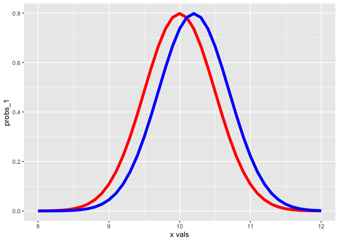
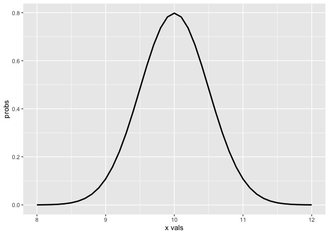

Probability Distributions Practical 5
================
Kathryn Van Artsdalen
2022-09-27

``` r
library(tidyverse)
```

    ## ── Attaching packages ─────────────────────────────────────── tidyverse 1.3.2 ──
    ## ✔ ggplot2 3.3.6      ✔ purrr   0.3.4 
    ## ✔ tibble  3.1.8      ✔ dplyr   1.0.10
    ## ✔ tidyr   1.2.0      ✔ stringr 1.4.1 
    ## ✔ readr   2.1.2      ✔ forcats 0.5.2 
    ## ── Conflicts ────────────────────────────────────────── tidyverse_conflicts() ──
    ## ✖ dplyr::filter() masks stats::filter()
    ## ✖ dplyr::lag()    masks stats::lag()

``` r
library(ggplot2)
library(dplyr)
```

### Q1

Write a function that returns the sample space for the experiment
consisting of samplign a 4 digit PIN \* Call your function get_all_perms

-   Essentially, your function does not take any arguments but returns
    the sample space consisting of all the four digit numbers

-   The function `expand.grid` expand.grid creates a data frame from all
    combinations of the supplied vectors or factors. For example:

``` r
expand.grid(0:1, 0:1, 0:1)
```

    ##   Var1 Var2 Var3
    ## 1    0    0    0
    ## 2    1    0    0
    ## 3    0    1    0
    ## 4    1    1    0
    ## 5    0    0    1
    ## 6    1    0    1
    ## 7    0    1    1
    ## 8    1    1    1

-   generates


-   Strategy, use `expand.grid` to generate the permutation for four
    verctation in the range 0:9
    -   Return the number of rows in that `data.frame`

``` r
### Write your code here
get_all_perms <- expand.grid(0:9, 0:9, 0:9, 0:9)
```

### Q2

The function above is not very useful since it always computes the same
thing, namely the number of possible permutation of digits. One way to
make it more useful is by passing as an argument the number of digits to
consider, i.e., the number of columns in `expand.grid`. Let;s call that
param `size`, which by default should be `4`. For exmaple:

-   `get_all_perms(size = 1 )` will return all the number of size 1
    (0-9)

-   `get_all_perms(size = 3 )` will return all the permutations of size
    3 (000 - to 999)

-   Hint: `expand.grid` requires the number of input parameters to match
    the permutation length. We need to automate that so that the number
    of vectors passed as input matches the `size` values passed into
    `get_all_perms`

    -   We can do that using `replicate`
    -   `replicate(2, c(1,2,3), simplify=FALSE)` will repeat the vector
        `c(1,2,3)` twice
        -   We need to pass `replicate` the value `simplify=FALSE` so
            that it does not convert the output for us into a matrix
    -   Use pipe (`%>%`) pass the output of `replicate` into expand.grid
    -   Make sure replicated generate the correct input for exand.grid

``` r
### Write your code here

# creating a function to standardize size to match permutation length
get_all_perms <- function(size) {
  size_setup <- expand.grid(replicate(size, c(0:9), simplify = FALSE))
  print(size_setup)
}

# testing our function
get_all_perms(size = 1) # permutation size 1
```

    ##    Var1
    ## 1     0
    ## 2     1
    ## 3     2
    ## 4     3
    ## 5     4
    ## 6     5
    ## 7     6
    ## 8     7
    ## 9     8
    ## 10    9

``` r
# get_all_perms(size = 2) for permutation size 2
# get_all_perms(size = 3) for permutation size 3
# get_all_perms(size = 4) for permutation size 4
```

### Q3

-   Given a fish disease that occurs with a probability of p= 0.43
-   You sampled 340 animals
-   How many of these animals should you expect to see the disease in?
-   Hint: you will need to compute the probability of each element of
    the sample space and find the value that has the highest probability

We would expect to see the disease in about 146 animals.

``` r
### Write your code here
diseased <- rbinom(340, 1, 0.43)
sum(diseased)
```

    ## [1] 159

### Q4

Plot the two following distributions:

$$
x \sim \mathcal{N}(10, 0.5) \\
y \sim \mathcal{N}(10.2, 0.5) \\
$$

-   Your plot should look like the following
    

-   Draw 40 values from the first distribution and store them in a
    variable called `x_sample`

-   Draw 40 values from the second distribution and store them in a
    variable called `y_sample`

    -   make sure you run the following line before you sample data
        `set.seed(42)`

-   Do a `t-`test to compute the `x_sample` and `y_sample`

    -   A `t-`test compares two vectors of values and predicts if the
        two vectors are from the same distribution
    -   The format for the t-test in R is

`t.test(x,y)` where `x` an `y` are the vectors of values we would like
to compare. \* Look at the `p-value`, if it’s smaller than say 0.05,
then there is a statistically significant difference between the two
datasets.

-   Do you agree with the conclusion of the `t-test`. In other words,
    would you be comfortable reporting in a publication that the data in
    `x_sample` and `y_sample` are statistically different?

``` r
# Plots comparing N(10, 0.5) and N(10.2, 0.5)
x <- seq(8,12, 0.1)
x_sample <- dnorm(x, 10, 0.5)
y_sample <- dnorm(x, 10.2, 0.5)
df <- data.frame(x_sample, y_sample)

ggplot(data = df, aes(x = x))+
  geom_line(aes(y = x_sample), color = "red", size = 2)+
  geom_line(aes(y = y_sample), color = "blue", size = 2)+
  xlab("x vals")+
  ylab("probs_1")
```

<!-- -->

``` r
# Write the code to run your t-test here
set.seed(42)
x_sample <- rnorm(40, 10, 0.5)
y_sample <- rnorm(40, 10.2, 0.5)
t.test(x_sample, y_sample)
```

    ## 
    ##  Welch Two Sample t-test
    ## 
    ## data:  x_sample and y_sample
    ## t = -2.1504, df = 72.3, p-value = 0.03486
    ## alternative hypothesis: true difference in means is not equal to 0
    ## 95 percent confidence interval:
    ##  -0.50040708 -0.01897381
    ## sample estimates:
    ## mean of x mean of y 
    ##  9.980232 10.239922

The t-test gave a result of p = 0.03, indicating that these
distributions are significantly different. However, I don’t agree with
this conclusion because when randomly sampling from these distributions,
the sample vectors can actually be very similar depending on the trial.
I ran additional t-tests on random samples from these distributions,
which resulted in p values of p = 0.65, p = 0.18, p = 0.27, and p =
0.74, which are not significant at all. Therefore, I cannot comfortably
say that the data in x_sample and y_sample are statistically different.

### Q5

-   We have used the function `dnorm` to plot the bell-shaped curve for
    a distribution \$ x (10, 0.5)\$
    -   Use seq(8, 12, 0.1) to generate the x-axis values
    -   The pdf should look like the following


-   Use `dnorm` to compute the probability density for each point along
    the $x-$axis generated using `seq()` above
    -   What do you notice? Hint, sum the values obtained

``` r
# Plot of N(10, 0.5) using x and x_sample from previous question
ggplot(data = df, aes(x = x))+
  geom_line(aes(y = x_sample), size = 1)+
  xlab("x vals")+
  ylab("probs")
```

<!-- -->

``` r
# Probability density for each point 
densities <- dnorm(x, 10, 0.5)

# Sum of densities
sum(densities)
```

    ## [1] 9.999599

The sum of the probability densities is 9.999599, so basically 10 which
is the mean of the distribution.

### Q6 Optional Challenge

What transformation can you carry out to transform the value to actual
probabilities, i.e., values that sum to 1. Write code to test whether
your hypothesis works.

We are starting with the probability density function and have
calculated area under the curve at each point by intervals of 0.1 from x
= 8 to x = 12 along the x-axis. The probability is just the height of
the area. Area = base \* height, and we have the area (densities vector)
and base (0.1). We can divide each value in the densities vector by 0.1
to determine the height, and thus the probability.

``` r
# Write the code here
probs <- densities / 0.1
sum(probs)
```

    ## [1] 99.99599

Although the approach seems logical for this transformation, my
hypothesis did not work, as the probabilities sum to 100 and not 1.
