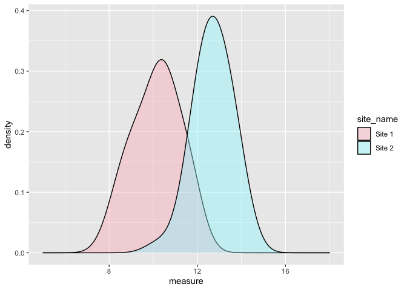
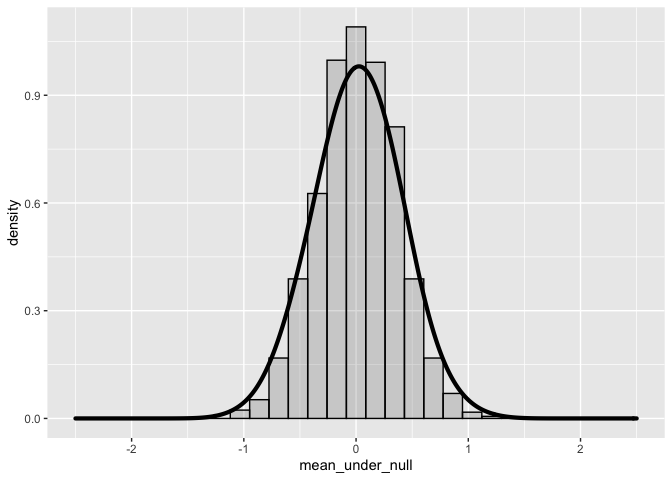
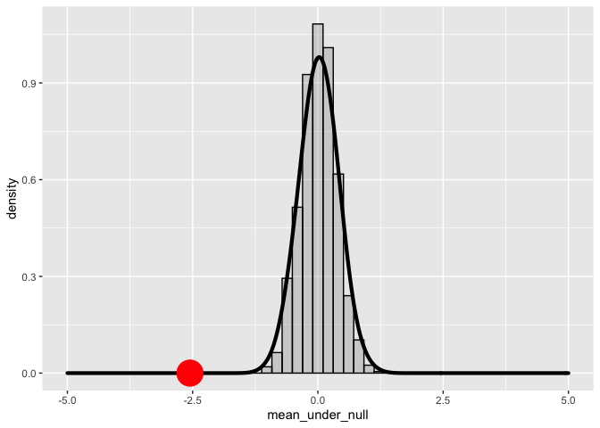
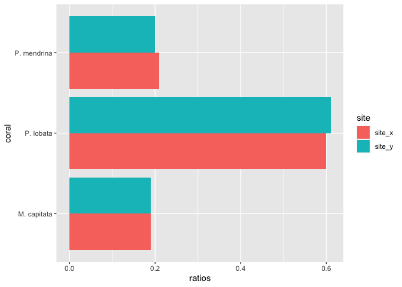
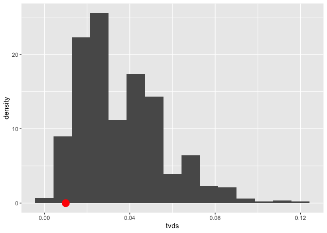

Experience 6 Hypothesis Testing
================
Kathryn Van Artsdalen
2022-10-09

``` r
library(tidyverse)
```

    ## ── Attaching packages ─────────────────────────────────────── tidyverse 1.3.2 ──
    ## ✔ ggplot2 3.3.6      ✔ purrr   0.3.4 
    ## ✔ tibble  3.1.8      ✔ dplyr   1.0.10
    ## ✔ tidyr   1.2.0      ✔ stringr 1.4.1 
    ## ✔ readr   2.1.2      ✔ forcats 0.5.2 
    ## ── Conflicts ────────────────────────────────────────── tidyverse_conflicts() ──
    ## ✖ dplyr::filter() masks stats::filter()
    ## ✖ dplyr::lag()    masks stats::lag()

Let’s use the code provided below to generate a dataset representing two
populations, each sampled from a Guassian with a specific population
mean. Here I am generating only 5 samples

``` r
set.seed(110)
data_1 = tibble(measure=rnorm(5, 10, 1))
data_1$site_name <- 'Site 1'
data_2 = tibble(measure=rnorm(5, 12, 1))
data_2$site_name <- 'Site 2'
complete_data = rbind(data_1, data_2)
complete_data
```

    ## # A tibble: 10 × 2
    ##    measure site_name
    ##      <dbl> <chr>    
    ##  1    10.3 Site 1   
    ##  2    11.4 Site 1   
    ##  3    10.6 Site 1   
    ##  4    11.5 Site 1   
    ##  5    10.4 Site 1   
    ##  6    12.5 Site 2   
    ##  7    12.0 Site 2   
    ##  8    13.5 Site 2   
    ##  9    10.4 Site 2   
    ## 10    12.2 Site 2

-   I compute the mean of the dataset above using the following code:
    -   feel free to deconstruct the code to see what each chunk does.

``` r
mean(complete_data[complete_data$site_name == "Site 1", ]$measure)
```

    ## [1] 10.84913

``` r
mean(complete_data[complete_data$site_name == "Site 2", ]$measure)
```

    ## [1] 12.11935

-   Use the `tapply` function instead of the code above to compute the
    means samples from “Site 1” and those from site 2
    -   See tapply for help if needed.

``` r
# Write your code here
tapply(complete_data$measure, complete_data$site_name, mean)
```

    ##   Site 1   Site 2 
    ## 10.84913 12.11935

Q.2

-   Use the bootstrapping-procedure covered in class to assess whether
    there is a statistically significant difference between the data in
    `Site 1` and that in `Site 2`.

Make sure you follow the approach discussed in class and which consists
of:

1.  Selecting an appropriate test statistic
2.  Bootstrapping a distribuion for the observed statistic under the
    null hypothesis
3.  Desciding whether to accept or reject the null based on the
    probability of the null
4.  provide a p-value to support your decision.

``` r
set.seed(110)
data_1 = tibble(measure=rnorm(40, 10, 1))
data_1$site_name <- 'Site 1'
data_2 = tibble(measure=rnorm(40, 13, 1))
data_2$site_name <- 'Site 2'
complete_data = rbind(data_1, data_2)
```

#### Q2.0

Complete the following by describing the null and the alternative
hypotheses we are testing here.

The null hypothesis is that there is no difference in the mean of site 1
and the mean of site 2. Any observed difference is merely due to
sampling variance. The alternative hypothesis is that there is a
significant difference between site 1 and 2, that is unlikely to have
arisen due to chance alone

``` r
t.test(data_1$measure, data_2$measure)
```

    ## 
    ##  Welch Two Sample t-test
    ## 
    ## data:  data_1$measure and data_2$measure
    ## t = -12.056, df = 74.217, p-value < 2.2e-16
    ## alternative hypothesis: true difference in means is not equal to 0
    ## 95 percent confidence interval:
    ##  -2.975853 -2.131763
    ## sample estimates:
    ## mean of x mean of y 
    ##  10.14979  12.70360

The p-value is 2.2e-16, which is very small and less than 0.05 so we
reject our null hypothesis. There is indeed a significant difference
between site 1 and 2.

#### Q.2.1

Produce a graph similar the one below (geom_density) display the
distributions. If you’re using the same seed as mine, your graph will
look exactly the same as the one below


``` r
# write your code here

ggplot(data = complete_data, aes(x = measure, fill = site_name))+
  geom_density(alpha = 0.4, bw = 0.6)+
  scale_fill_manual(values = c("lightpink", "cadetblue1"))+
  xlim(5, 18)+
  xlab("measure")+
  ylab("density")
```

<!-- -->

Q2.2 Select a proper test statistic and produce a distribution of the
statistic under the null hypothesis. Plot the data as both a histogram
and density curves. Your graph may look like this.


The test statistic is the difference in means.

``` r
set.seed(110)
data_1 = rnorm(40, 10, 1)
data_2 = rnorm(40, 13, 1)
mean(data_1) - mean(data_2)
```

    ## [1] -2.553808

``` r
# concatenate two vector
a = c(1,2,3)
b = c(4,5,6)
c(a, b)
```

    ## [1] 1 2 3 4 5 6

``` r
# shuffle a vecor
sample(1:5)
```

    ## [1] 3 1 4 2 5

``` r
#(split_pos + 1) : length(a)
```

``` r
# split data

split_pos = 4

a = 1:10

a[1:split_pos]
```

    ## [1] 1 2 3 4

``` r
a[(split_pos + 1) : length(a)]
```

    ## [1]  5  6  7  8  9 10

``` r
processOneIter = function(data_1, data_2){
    
    concat_data = c(data_1, data_2)
    len_concat_data = length(concat_data)
    
    len_data_1 = length(data_1)    
    shuffled_data = sample(concat_data)
    new_data_1 = shuffled_data[1:len_data_1]
    new_data_2 = shuffled_data[(len_data_1+1):len_concat_data]
    mean(new_data_1) - mean(new_data_2)
    
}
processOneIter(data_1, data_2)
```

    ## [1] -0.3806805

``` r
replicate(5, processOneIter(data_1, data_2))
```

    ## [1]  0.11527511  0.54807058  0.27159579  0.80727577 -0.02470954

``` r
# histogram and density curve
mean_under_null = replicate(1000, processOneIter(data_1, data_2))

ggplot()+
  geom_histogram(aes(mean_under_null, y=..density..), bins = 30, alpha = 0.2, color = "black") + 
  geom_density(aes(mean_under_null), bw = 0.2, size = 1.5) + 
  xlim(-2.5, 2.5)
```

<!-- -->

#### Q2.3.

Calculate and plot the observed statistic on the graph you created in
Q.2.2.

``` r
# observed value
observed <- mean(data_1) - mean(data_2)
observed
```

    ## [1] -2.553808

``` r
# histogram with observed statistic
ggplot()+
  geom_histogram(aes(mean_under_null, y=..density..), bins = 50, alpha=0.2, color = "black") + 
  geom_density(aes(mean_under_null), bw = 0.2, size = 1.5) + 
  xlim(-5, 5) + 
  geom_point(aes(observed, 0), color = "red", size = 10)
```

<!-- -->

#### Q2.4

Compute the p-value of the observed statistic under the null. What do
you conclude about the hypotheses you enunciated in Q2.3

``` r
# p value
sum(mean_under_null <= observed) / length(mean_under_null)
```

    ## [1] 0

The p-value is 0 meaning that it is very unlikely we would observe this
test statistic observation (-2.55) in a randomized scenario. The test
statistic is very different from what the null hypothesis predicts. It
is unlikely that there is no difference between the means of the two
distributions.

#### Q.3

-   The proportion of the of *P. lobata*, *M. capitata* and *P.
    mendrina* at a site X are c(0.60, 0.19, 0.21).
-   You surveyed site Y with different environmental conditions and
    obtains the following proportions for the three corals (0.61, 0.19,
    0.20). Use the multinomial non-parametric hypotheses test to assess
    whether the proportions obtained at sites X and Y are statistically
    different.

Although not explicitly required, your test should cover all the steps
in Q2, i.e. appropriate graph(s) when possible, test statistics, and
conclusion.

## Hypotheses

*Null hypothesis:* There is no statistical difference in the proportions
of P. lobata, M. capitata, and P. mendrina at site x and those at site
y. Any observed differences in proportions is just due to sampling
variance and chance.

*Alternative hypothesis:* The observed difference in proportions at the
two sites is not merely chance because there is indeed a difference.

## Coral proportions dataset and graphing

``` r
# creating dataset and tibble of coral proportions at site x and site y
coral = c('P. lobata', 'P. lobata', 'M. capitata', 'M. capitata', 'P. mendrina', 'P. mendrina')
ratios = c(0.6, 0.61, 0.19, 0.19, 0.21, 0.20)
site = rep(c('site_x', 'site_y'), 3)

coral_proportions <- tibble(coral, ratios, site)
coral_proportions
```

    ## # A tibble: 6 × 3
    ##   coral       ratios site  
    ##   <chr>        <dbl> <chr> 
    ## 1 P. lobata     0.6  site_x
    ## 2 P. lobata     0.61 site_y
    ## 3 M. capitata   0.19 site_x
    ## 4 M. capitata   0.19 site_y
    ## 5 P. mendrina   0.21 site_x
    ## 6 P. mendrina   0.2  site_y

``` r
# plotting coral proportions at sites x and y
ggplot(coral_proportions, aes(x = coral, y = ratios, fill = site)) + 
    geom_bar(position="dodge", stat="identity") + 
    coord_flip()
```

<!-- -->

## Total Variation Distance

We will use the Total Variation Distance as the test statistic.

``` r
subtract <- function(x){
    x[1] - x[2]
}

subtract(c(20, 15))
```

    ## [1] 5

``` r
tapply(coral_proportions$ratios, coral_proportions$coral, subtract)
```

    ## M. capitata   P. lobata P. mendrina 
    ##        0.00       -0.01        0.01

``` r
subtract_abs <- function(x){
    abs(x[1] - x[2])
}

sum(tapply(coral_proportions$ratios, coral_proportions$site, subtract_abs))/2
```

    ## [1] 0.415

``` r
sample(c('_M. capitata_', '_P. mendrina_', '_P. mendrina_'), 200, replace=TRUE, prob=c(0.60, 0.19, 0.21))
```

    ##   [1] "_M. capitata_" "_P. mendrina_" "_P. mendrina_" "_M. capitata_"
    ##   [5] "_M. capitata_" "_M. capitata_" "_M. capitata_" "_M. capitata_"
    ##   [9] "_P. mendrina_" "_M. capitata_" "_M. capitata_" "_P. mendrina_"
    ##  [13] "_M. capitata_" "_P. mendrina_" "_P. mendrina_" "_M. capitata_"
    ##  [17] "_M. capitata_" "_M. capitata_" "_M. capitata_" "_P. mendrina_"
    ##  [21] "_M. capitata_" "_M. capitata_" "_M. capitata_" "_M. capitata_"
    ##  [25] "_P. mendrina_" "_P. mendrina_" "_P. mendrina_" "_M. capitata_"
    ##  [29] "_M. capitata_" "_P. mendrina_" "_M. capitata_" "_P. mendrina_"
    ##  [33] "_P. mendrina_" "_P. mendrina_" "_M. capitata_" "_M. capitata_"
    ##  [37] "_M. capitata_" "_P. mendrina_" "_M. capitata_" "_M. capitata_"
    ##  [41] "_M. capitata_" "_M. capitata_" "_P. mendrina_" "_M. capitata_"
    ##  [45] "_P. mendrina_" "_M. capitata_" "_P. mendrina_" "_M. capitata_"
    ##  [49] "_M. capitata_" "_P. mendrina_" "_M. capitata_" "_P. mendrina_"
    ##  [53] "_P. mendrina_" "_M. capitata_" "_P. mendrina_" "_M. capitata_"
    ##  [57] "_M. capitata_" "_M. capitata_" "_M. capitata_" "_M. capitata_"
    ##  [61] "_M. capitata_" "_P. mendrina_" "_M. capitata_" "_M. capitata_"
    ##  [65] "_M. capitata_" "_M. capitata_" "_P. mendrina_" "_M. capitata_"
    ##  [69] "_M. capitata_" "_M. capitata_" "_M. capitata_" "_M. capitata_"
    ##  [73] "_P. mendrina_" "_M. capitata_" "_M. capitata_" "_M. capitata_"
    ##  [77] "_P. mendrina_" "_P. mendrina_" "_M. capitata_" "_M. capitata_"
    ##  [81] "_P. mendrina_" "_M. capitata_" "_M. capitata_" "_M. capitata_"
    ##  [85] "_M. capitata_" "_P. mendrina_" "_P. mendrina_" "_M. capitata_"
    ##  [89] "_P. mendrina_" "_M. capitata_" "_P. mendrina_" "_P. mendrina_"
    ##  [93] "_P. mendrina_" "_M. capitata_" "_P. mendrina_" "_P. mendrina_"
    ##  [97] "_M. capitata_" "_P. mendrina_" "_M. capitata_" "_M. capitata_"
    ## [101] "_P. mendrina_" "_M. capitata_" "_P. mendrina_" "_P. mendrina_"
    ## [105] "_M. capitata_" "_M. capitata_" "_M. capitata_" "_M. capitata_"
    ## [109] "_M. capitata_" "_P. mendrina_" "_P. mendrina_" "_P. mendrina_"
    ## [113] "_M. capitata_" "_M. capitata_" "_P. mendrina_" "_M. capitata_"
    ## [117] "_M. capitata_" "_M. capitata_" "_P. mendrina_" "_M. capitata_"
    ## [121] "_P. mendrina_" "_P. mendrina_" "_P. mendrina_" "_P. mendrina_"
    ## [125] "_M. capitata_" "_P. mendrina_" "_P. mendrina_" "_M. capitata_"
    ## [129] "_M. capitata_" "_P. mendrina_" "_M. capitata_" "_M. capitata_"
    ## [133] "_P. mendrina_" "_P. mendrina_" "_M. capitata_" "_M. capitata_"
    ## [137] "_M. capitata_" "_M. capitata_" "_M. capitata_" "_P. mendrina_"
    ## [141] "_M. capitata_" "_M. capitata_" "_P. mendrina_" "_M. capitata_"
    ## [145] "_M. capitata_" "_M. capitata_" "_M. capitata_" "_P. mendrina_"
    ## [149] "_M. capitata_" "_P. mendrina_" "_P. mendrina_" "_M. capitata_"
    ## [153] "_M. capitata_" "_M. capitata_" "_P. mendrina_" "_M. capitata_"
    ## [157] "_M. capitata_" "_M. capitata_" "_M. capitata_" "_P. mendrina_"
    ## [161] "_M. capitata_" "_M. capitata_" "_M. capitata_" "_M. capitata_"
    ## [165] "_M. capitata_" "_M. capitata_" "_M. capitata_" "_M. capitata_"
    ## [169] "_M. capitata_" "_M. capitata_" "_M. capitata_" "_M. capitata_"
    ## [173] "_M. capitata_" "_M. capitata_" "_P. mendrina_" "_P. mendrina_"
    ## [177] "_M. capitata_" "_M. capitata_" "_M. capitata_" "_M. capitata_"
    ## [181] "_P. mendrina_" "_P. mendrina_" "_M. capitata_" "_M. capitata_"
    ## [185] "_P. mendrina_" "_M. capitata_" "_M. capitata_" "_P. mendrina_"
    ## [189] "_P. mendrina_" "_P. mendrina_" "_M. capitata_" "_M. capitata_"
    ## [193] "_M. capitata_" "_M. capitata_" "_P. mendrina_" "_M. capitata_"
    ## [197] "_M. capitata_" "_P. mendrina_" "_P. mendrina_" "_P. mendrina_"

``` r
rmultinom(1, 200, prob=c(0.60, 0.19, 0.21))
```

    ##      [,1]
    ## [1,]  131
    ## [2,]   40
    ## [3,]   29

``` r
rmultinom(1, 200, prob=c(0.60, 0.19, 0.21))/200
```

    ##       [,1]
    ## [1,] 0.535
    ## [2,] 0.250
    ## [3,] 0.215

``` r
sampleOneIteration = function(){
    true_proportions = c(0.60, 0.19, 0.21)
    sample_proportions = rmultinom(1, 200, prob=c(0.60, 0.19, 0.21))/200
    sample_tvd = sum(abs(true_proportions - sample_proportions))/2
    sample_tvd
        
}
sampleOneIteration()
```

    ## [1] 0.03

``` r
tvds <- replicate(1000, sampleOneIteration())
```

``` r
observed_stat = sum(tapply(coral_proportions$ratios, coral_proportions$coral, subtract_abs))/2
observed_stat
```

    ## [1] 0.01

``` r
ggplot()+ 
  geom_histogram(aes(tvds, ..density..), bins = 15) +
  geom_point(aes(observed_stat, 0), size = 5, color="red")
```

<!-- -->

``` r
p_value = sum(tvds > observed_stat)  / length(tvds)
p_value
```

    ## [1] 0.947

The p-value is 0.946 which is greater than 0.05. Therefore, there is no
significant difference between the proportion of corals at site x and
site y, and we accept our null hypothesis.
