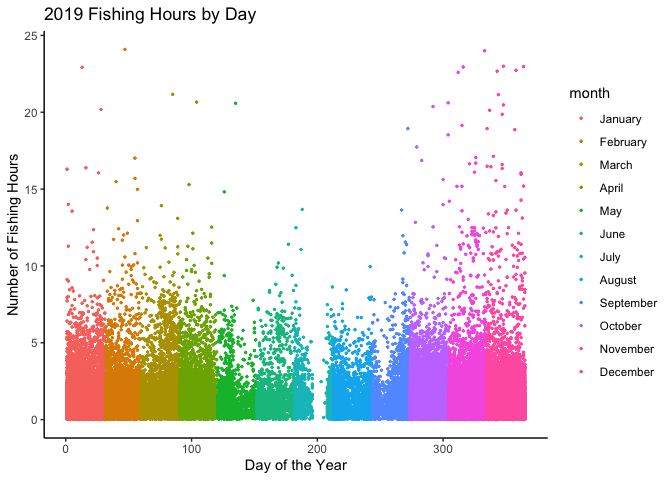
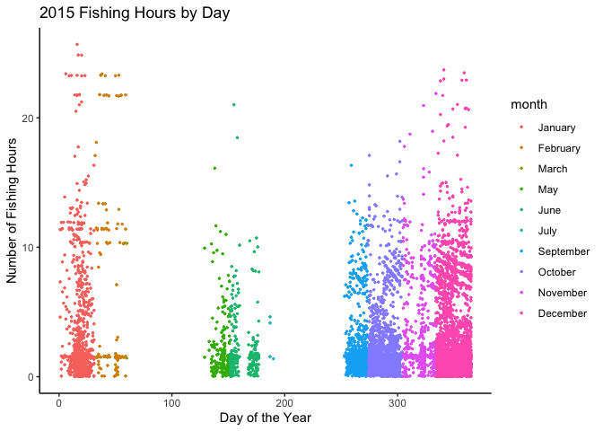
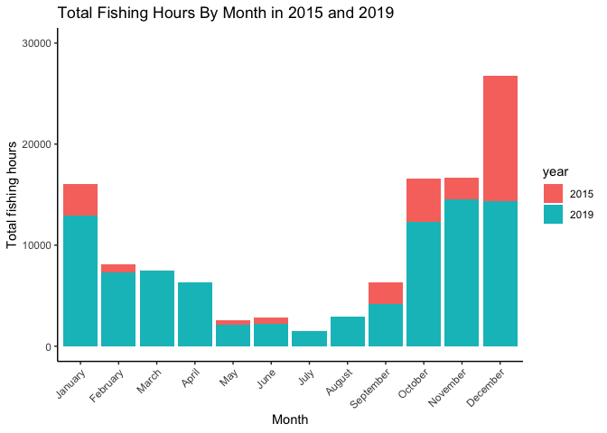
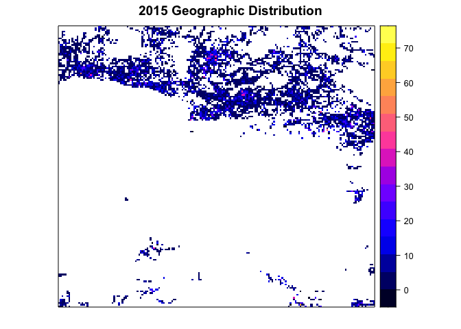
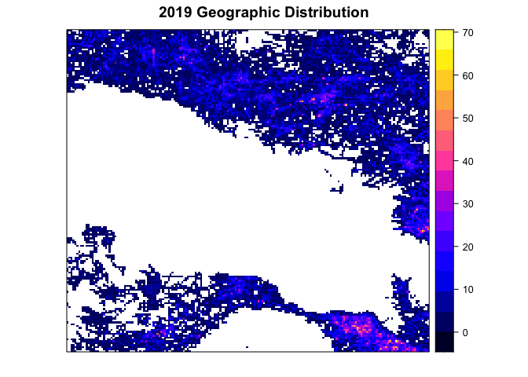

Changes in Fishing Vessel Behavior After the Expansion of the
Papahānaumokuākea Marine National Monument
================
Kathryn Van Artsdalen, Rachel Nunley, Madeleine Hardt
2022-11-08

``` r
# importing packages
library(tidyverse)
```

    ## ── Attaching packages ─────────────────────────────────────── tidyverse 1.3.2 ──
    ## ✔ ggplot2 3.3.6      ✔ purrr   0.3.4 
    ## ✔ tibble  3.1.8      ✔ dplyr   1.0.10
    ## ✔ tidyr   1.2.0      ✔ stringr 1.4.1 
    ## ✔ readr   2.1.2      ✔ forcats 0.5.2 
    ## ── Conflicts ────────────────────────────────────────── tidyverse_conflicts() ──
    ## ✖ dplyr::filter() masks stats::filter()
    ## ✖ dplyr::lag()    masks stats::lag()

``` r
library(dplyr)
library(lubridate)
```

    ## 
    ## Attaching package: 'lubridate'
    ## 
    ## The following objects are masked from 'package:base':
    ## 
    ##     date, intersect, setdiff, union

``` r
library(raster)
```

    ## Loading required package: sp
    ## 
    ## Attaching package: 'raster'
    ## 
    ## The following object is masked from 'package:dplyr':
    ## 
    ##     select

``` r
library(ggplot2)
library(readr)
library(knitr)
library(rstatix)
```

    ## 
    ## Attaching package: 'rstatix'
    ## 
    ## The following object is masked from 'package:raster':
    ## 
    ##     select
    ## 
    ## The following object is masked from 'package:stats':
    ## 
    ##     filter

## Introduction & Background

The Papahānaumokuākea National Marine Monument protects natural and
cultural resources within 583,000 square miles of ocean waters,
including ten islands and atolls of the Northwestern Hawaiian Islands.
Fishing activity is prohibited within the monument. We analyzed changes
in fishing vessels and hours spent fishing before and after the
expansion of Papahānaumokuākea in 2016 using open source data from the
Global Fish Watch (GFW) dataset. Due to the extremely large dataset, we
analyzed two years of data, one from before the expansion and one from
after the expansion. Specifically, we looked at 2015 (before) and 2019
(after). We hypothesized that fishing activity would be significantly
lower in 2019 compared to 2015 because of the increased area of
restrictions on fishing activity after the monument’s expansion.

GFW is a global remote vessel tracking system that provides data on
worldwide commercial fishing activities via automatic identification
systems on each vessel. It was launched by Google in partnership with
Oceana and SkyTruth. It is the first open-access platform of
vessel-based human activity at sea, and can be used to track changes in
fishing activity globally as well as potentially detect illegal
activity.

Our final, cleaned dataset had 65,564 observations for 8 variables:
observation number, latitude, longitude, mmsi (Maritime Mobile Service
Identity), fishing hours, month, day, year. We worked with data
constrained by latitude (18 to 35) and longitude (-161 to -183) in the
general vicinity of the Papahānaumokuākea monument around Hawai’i. We
analyzed fishing hours around the monument by year, month, and vessel
country. We performed data wrangling to clean our data, did some initial
exploratory analysis of fishing hours by day, conducted a t-test of
significance between 2015 and 2019 fishing hours, and created graphs,
tables, and maps to visualize geographic distribution and changes in
fishing activity.

## Data Wrangling

First we downloaded the daily data folders for each year from GFW, and
looped through all files from each to combine. Then, we combined 2015
and 2019 data into one dataset. Below is the documentation, however, it
has been commented out because this step took hours to complete as there
were hundreds of thousands to millions of observations per year to begin
with. We created a csv of the 2015 and 2019 data specific to
Papahānaumokuākea, which we will read in as csv instead of uploading the
hundreds of individual year folders.

``` r
# compile all files from every day in 2019 into one
#files <- list.files(path = "~/Documents/UH Marine Bio/MBIO 612/R Code/GitHub/Project/data/mmsi-daily-csvs-10-v2-2019", pattern = "*.csv", full.names = TRUE, recursive = TRUE) # retrieves files for each day from 2019
#datalist = list()


#for (i in 1:length(files)){ # loops through all 2019 files from each day and combines into one dataset
        #temp=read.csv(files[i]) # reads in csv files for each day from 2019
        #temp$date <- as.Date(temp$date) # we will work on separating out date column into month and year
        #temp$month <- months(temp$date) # creates month column
        #temp$year <- lubridate::year(temp$date) # creates year column
        #temp$i <- i # day number
        #temp <- subset(temp, fishing_hours > 0) # remove all nonfishing vessels in csv files 
        #temp <- subset(temp, cell_ll_lat > 18 & cell_ll_lat < 35 & cell_ll_lon < -161 & cell_ll_lon > -183) # coordinates for Papahānaumokuākea monument
        #datalist[[i]] <- temp
#}

#fishing_2019 <- do.call(rbind, datalist) # combine all files into one dataframe
#write.csv(fishing_2019, "fishing_2019.csv") # creating CSV 


# repeat for 2015 and compile all files from every day in 2015 into one
#files <- list.files(path = "~/Documents/UH Marine Bio/MBIO 612/R Code/GitHub/Project/data/mmsi-daily-csvs-10-v2-2015", pattern = "*.csv", full.names = TRUE, recursive = TRUE) # retrieves csv files for each day in 2015
#datalist = list()

#for (i in 1:length(files)){ # loops through all 2015 files from each day and combines into one dayaset
        #temp=read.csv(files[i]) # reads in csv files for each day from 2019
        #temp$date <- as.Date(temp$date) # we will work on separating date out to month and year
        #temp$month <- months(temp$date)  # creates month column
        #temp$year <- lubridate::year(temp$date) # creates year column
        #temp$i <- i # day number
        #temp <- subset(temp, fishing_hours > 0) # remove all nonfishing vessels in csv files 
        #temp <- subset(temp, cell_ll_lat > 18 & cell_ll_lat < 35 & cell_ll_lon < -161 & cell_ll_lon > -183)# coordinates for Papahānaumokuākea monument
        #datalist[[i]] <- temp
#}

#fishing_2015 <- do.call(rbind, datalist) # combine all files into one dataframe
#write.csv(fishing_2015, "fishing_2015.csv") # creating CSV 


#data <- rbind(fishing_2015, fishing_2019) # this combines the 2015 and 2019 data into one dataset
#write.csv(data, "data2015_2019.csv") # writing it into a CSV that you can read in
```

``` r
# loading dataset if starting from csv file and data has already previously been compiled using above steps
data <- read.csv("~/Documents/UH Marine Bio/MBIO 612/R Code/GitHub/Project/data/data2015_2019.csv")
```

``` r
# cleaning and tidying data
data <- data %>%
  rename('latitude' = 'cell_ll_lat') %>% # renames latitude column
  rename('longitude' = 'cell_ll_lon') %>% # renames longtiude column
  rename('day' = 'i') %>% # renames day of the month column
  relocate(day, .after = month) %>% # moves day column to after month column
  dplyr::select(-c(date, hours)) %>% # removes date and hours columns (replicate data which are stored in month, day, and year columns and fishing_hours) 
  na.omit() # removes any NA
```

``` r
# sorting the months in calendar order
data$month <- factor(data$month, levels = c("January", 
                                            "February", 
                                            "March", 
                                            "April", 
                                            "May", 
                                            "June", 
                                            "July", 
                                            "August", 
                                            "September", 
                                            "October", 
                                            "November", 
                                            "December")) 
```

``` r
data$year <- as.factor(data$year) # change year variable from numeric/continuous to categorical
```

## Exploratory Analysis of Fishing Hours by Day

``` r
# Let's start with some initial exploratory analysis of fishing hours throughout the year for 2019 by day
data %>%
  filter(year == "2019") %>%
  ggplot(aes(x = day, y = fishing_hours , color = month))+
  geom_point(size = 0.5)+
  ggtitle("2019 Fishing Hours by Day")+
  xlab("Day of the Year")+ 
  ylab("Number of Fishing Hours")+
  theme_classic()
```

<!-- -->

``` r
# repeating exploration with 2015 data by day
data %>%
  filter(year == "2015") %>%
  ggplot(aes(x = day, y = fishing_hours , color = month))+
  geom_point(size = 0.5)+
  ggtitle("2015 Fishing Hours by Day")+
  xlab("Day of the Year")+ 
  ylab("Number of Fishing Hours")+
  theme_classic()
```

<!-- -->

We initially see that fishing activity appears to have increased from
2015 to 2019, especially during the middle of the year. Let’s explore
this data more deeply.

## Total Monthly Fishing Hours

``` r
# calculate total monthly fishing hours by month and year
monthly_fishing_hours <- data %>% 
  group_by(month, year) %>% 
  summarize(monthly_total = round(sum(fishing_hours)))
```

    ## `summarise()` has grouped output by 'month'. You can override using the
    ## `.groups` argument.

``` r
#table of total monthly fishing hours
kable(monthly_fishing_hours)
```

| month     | year | monthly_total |
|:----------|:-----|--------------:|
| January   | 2015 |          3072 |
| January   | 2019 |         12969 |
| February  | 2015 |           871 |
| February  | 2019 |          7263 |
| March     | 2015 |            12 |
| March     | 2019 |          7442 |
| April     | 2019 |          6310 |
| May       | 2015 |           435 |
| May       | 2019 |          2115 |
| June      | 2015 |           563 |
| June      | 2019 |          2258 |
| July      | 2015 |            12 |
| July      | 2019 |          1511 |
| August    | 2019 |          2964 |
| September | 2015 |          2168 |
| September | 2019 |          4195 |
| October   | 2015 |          4296 |
| October   | 2019 |         12269 |
| November  | 2015 |          2163 |
| November  | 2019 |         14508 |
| December  | 2015 |         12380 |
| December  | 2019 |         14341 |

``` r
# creating bar graph to plot total monthly fishing hours
ggplot(monthly_fishing_hours, aes(x=month, y=monthly_total, fill = year)) + # sets up plot of monthly fishing hours and separate by year
  geom_bar(stat = "identity") + # create bar graph
  theme_classic()+
  ylim(0, 30000)+ # set range of y-axis values from 0 to 30000
  xlab("Month")+ # x axis label
  ylab("Total fishing hours")+ # y axis label
  ggtitle("Total Fishing Hours By Month in 2015 and 2019")+ # graph title
  theme(axis.text.x = element_text(angle = 45, hjust=1)) 
```

<!-- -->

In 2019, November, December, January, and October had the most total
fishing hours with 14508, 14341, 12969, and 12269 hours, respectively.
In 2015, December overwhelmingly had the most fishing hours of 12380
hours. The summer months of May, June, July, and August had the fewest
fishing hours in 2019. March, April, July, and August had the fewest
fishing hours in 2015.

## Test of Significance for 2015 vs 2019 Fishing Activity

``` r
# calculate total yearly fishing hours 
yearly_fishing_hours <- data %>% 
  group_by(year) %>% 
  summarize(total_fishing_hours = round(sum(fishing_hours))) %>%
  rename('total fishing hours' = 'total_fishing_hours')

# print table of data
kable(yearly_fishing_hours)
```

| year | total fishing hours |
|:-----|--------------------:|
| 2015 |               25971 |
| 2019 |               88145 |

``` r
# T-test to see if there's a difference between years in terms of fishing hours
stat.test <- data %>% 
  t_test(fishing_hours ~ year) %>%
  add_significance()
stat.test
```

    ## # A tibble: 1 × 9
    ##   .y.           group1 group2    n1    n2 statistic    df         p p.signif
    ##   <chr>         <chr>  <chr>  <int> <int>     <dbl> <dbl>     <dbl> <chr>   
    ## 1 fishing_hours 2015   2019    8932 56632      36.6 9461. 4.38e-274 ****

We noticed a large difference in the total fishing hours between 2015
and 2019 calculated above, so we performed a t-test to see if this
difference is significant. Our null hypothesis was that there was no
difference in total fishing hours between the years, while our
alternative hypothesis was that there was a difference. Surprisingly,
2019 had significantly more fishing hours (p \<\< 0.001). We
hypothesized that 2019 would have fewer fishing hours because the
monument had been expanded and so we expected that fishing would be more
tightly restricted but apparently fishing activity has increased
significantly.

## Geographical Distribution of Fishing Activity

``` r
# We will sum all fishing hours occurring around Hawaii and the monument 
# in each grid cell in 2015 by creating a raster map
data_2015 <- data %>%
  filter(year == "2015") %>%
  group_by(latitude, longitude) %>%
  summarize(annual_total2015 = sum(fishing_hours)) # fishing hours per grid cell
```

    ## `summarise()` has grouped output by 'latitude'. You can override using the
    ## `.groups` argument.

``` r
raster2015 <- rasterFromXYZ(data_2015[, c('longitude', 'latitude', 'annual_total2015')])
spplot(raster2015, main = '2015 Geographic Distribution')
```

<!-- -->

``` r
# Now we will sum all fishing hours occurring around Hawaii and the monument 
# in each grid cell in 2019 by creating a raster map
data_2019 <- data %>%
  filter(year == "2019") %>%
  group_by(latitude, longitude) %>%
  summarize(annual_total2019 = sum(fishing_hours))  # fishing hours per grid cell
```

    ## `summarise()` has grouped output by 'latitude'. You can override using the
    ## `.groups` argument.

``` r
raster2019 <- rasterFromXYZ(data_2019[, c('longitude', 'latitude', 'annual_total2019')])
spplot(raster2019, main = '2019 Geographic Distribution')
```

<!-- -->

The rasters help us visualize where the fishing is occurring. Even
before the monument was expanded, it appears that there was little to no
fishing activity around the monument. So the increase in fishing
activity from 2015 to 2019 was outside the monument.

In a University of Hawaii news article (Study finds Pacific marine
national monuments do not harm fishing industry,
<https://www.hawaii.edu/news/2020/02/20/marine-national-monuments-fishing-industry/>)
Professor John Lynham reported that “In 2015, when Papahānaumokuākea was
open to fishing, 97 percent of fishing was taking place outside the
monument in waters that are still open to fishing today.” He concluded
that “Papahānaumokuākea and the Pacific Remote Islands marine national
monuments have not hurt the fishing industry overall.” We clearly see
this pattern from our data analysis as well. This was an interesting
result, and we admire that even before the monument was officially
expanded, fishing vessels recognized the significance of respecting
Papahānaumokuākea by limiting fishing activity around important reefs.

## Fishing Activity by Vessel and Country

``` r
# now we will look at which ships had the most fishing hours in 2019 
vessel <- data %>% 
  filter(year == "2019") %>% # selecting year 2019
  group_by(mmsi) %>% # grouping my ship ID (mmsi)
  summarize(total_fishing_hours2019 = round(sum(fishing_hours)))%>% # summing fishing hours
  arrange(-total_fishing_hours2019) # ordering from greatest number of hours
print(vessel, n = 10) # top 10 ships with the most fishing hours
```

    ## # A tibble: 205 × 2
    ##         mmsi total_fishing_hours2019
    ##        <int>                   <dbl>
    ##  1 416000013                    1796
    ##  2 368012840                    1730
    ##  3 367716130                    1526
    ##  4 416367000                    1448
    ##  5 412420945                    1429
    ##  6 367449780                    1385
    ##  7 576850000                    1370
    ##  8 416002900                    1273
    ##  9 416000411                    1257
    ## 10 416111500                    1241
    ## # … with 195 more rows

``` r
top_vessels <- vessel %>%
  filter(total_fishing_hours2019 > 1240) %>% # creating new data table with top 10 fishing
  rename('2019 total fishing hours' = 'total_fishing_hours2019')

# creating name vector with vessel names we looked up based on the mmsi ID
name <- c("HORNG YIH FWU NO268", 
          "Princess Pearla", 
          "Pacific Star", 
          "HSIANG HSIN NO6", 
          "PING TAI RONG 88", 
          "Pleasure Craft Captain Andy", 
          "YI SHUN NO102", "FONG CHUN NO66", 
          "HORNG YIH FWU NO368", "FONGCHUN36") 

# creating vector with the flag that each vessel is registered under
flag <- c("Tawain", "USA", "USA", "Tawain", "China", "USA", "Vanuatu", "Taiwan", "Taiwan", "Taiwan") 

# column bind vessel name and flag to mmsi and fishing hours data
top_vessels <- cbind(top_vessels, name, flag) 
kable(top_vessels) # display table
```

|      mmsi | 2019 total fishing hours | name                        | flag    |
|----------:|-------------------------:|:----------------------------|:--------|
| 416000013 |                     1796 | HORNG YIH FWU NO268         | Tawain  |
| 368012840 |                     1730 | Princess Pearla             | USA     |
| 367716130 |                     1526 | Pacific Star                | USA     |
| 416367000 |                     1448 | HSIANG HSIN NO6             | Tawain  |
| 412420945 |                     1429 | PING TAI RONG 88            | China   |
| 367449780 |                     1385 | Pleasure Craft Captain Andy | USA     |
| 576850000 |                     1370 | YI SHUN NO102               | Vanuatu |
| 416002900 |                     1273 | FONG CHUN NO66              | Taiwan  |
| 416000411 |                     1257 | HORNG YIH FWU NO368         | Taiwan  |
| 416111500 |                     1241 | FONGCHUN36                  | Taiwan  |

Taiwan and the USA had the greatest number of fishing hours around the
monument, and dominated the top 10 vessels with the most fishing hours
in 2019. Five Tawaianese and three American vessels were in the top 10.

## Acknowledgements

Thank you to Professor Mahdi Belcaid for teaching us skills in R for
data wrangling, visualization, and analysis this semester. Thank you
also to Professor Elizabeth Madin and Annie Innes-Gold for introducing
us to the Global Fish Watch dataset.
