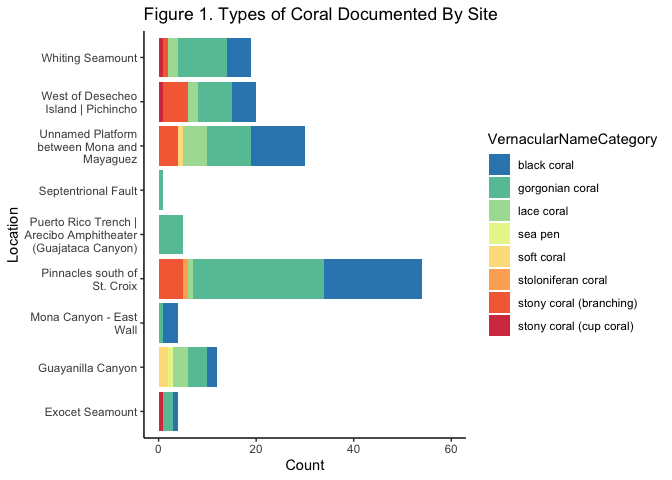
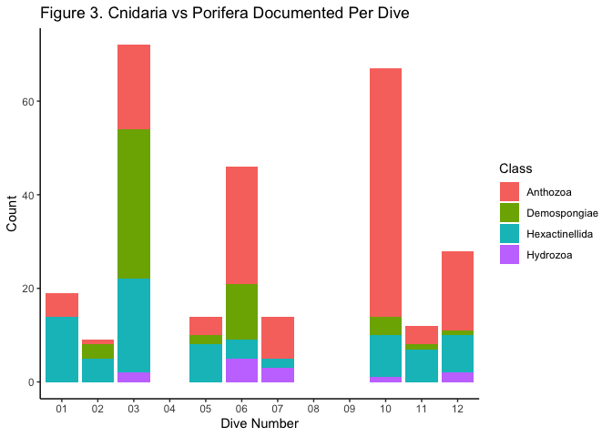
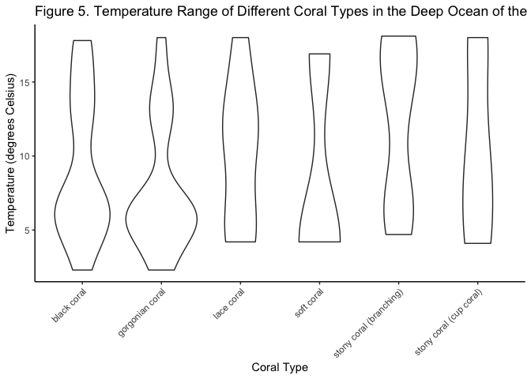
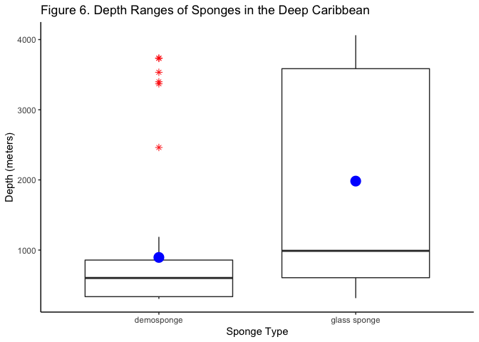

Tidy Final Project: NOAA Deep Sea Coral and Sponge Dataset from Okeanos
Explorer April 2015 Puerto Rico Cruise
================
Kathryn Van Artsdalen, Rachel Nunley, Madeleine Hardt
2022-12-08

``` r
# loading packages
library(tidyverse)
```

    ## ── Attaching packages ─────────────────────────────────────── tidyverse 1.3.2 ──
    ## ✔ ggplot2 3.3.6      ✔ purrr   0.3.4 
    ## ✔ tibble  3.1.8      ✔ dplyr   1.0.10
    ## ✔ tidyr   1.2.0      ✔ stringr 1.4.1 
    ## ✔ readr   2.1.2      ✔ forcats 0.5.2 
    ## ── Conflicts ────────────────────────────────────────── tidyverse_conflicts() ──
    ## ✖ dplyr::filter() masks stats::filter()
    ## ✖ dplyr::lag()    masks stats::lag()

``` r
library(ggpubr)
library(ggplot2)
library(readr)
library(dplyr)
library(stringr)
library(RColorBrewer)
```

``` r
# loading dataset
survey <- read.csv("~/Documents/UH Marine Bio/MBIO 612/R Code/GitHub/Tidy_Dataset/NOAA_PuertoRico_2015.csv")
```

## Introduction

This dataset comes from the National Oceanic and Atmospheric
Administration (NOAA) and is based on findings from the Okeanos Explorer
cruise EX-15-02-L3 in April 2015. The cruise characterized deep-sea
coral and sponge communities within Puerto Rico. The original data are
from
<https://deepseacoraldata.noaa.gov/DatasetID_Table/DatasetID_Table.html>.
The dataset has been modified slightly for the purposes of this project
to start as untidy so it can be cleaned up. The actual data have not
been altered in any way.

## Tidying & Cleaning Data

We implemented numerous commands to first tidy and then clean the
dataset including separating columns so that each column represents a
single piece of data, renaming columns without numerical values,
omitting NA and blank data, moving columns to be next to relevant
variables, deleting irrelvant columns, and ordering rows based on
different columns.

``` r
survey <- survey %>%
  separate(col = Coordinates, into = c('Latitude', 'Longitude'), sep = ',') %>% # separates coordinates column into two separate columns for latitude and longitude
  rename('ObservationDate' = 'Date2015') %>% # column headers cannot be numbers so we rename to variable name
  separate(col = ObservationDate, into = c('Month', 'Day', 'Year'), sep = "/") %>% # separates observation date column into separate columns by month, day, and year
  separate(col = EventID, into = c('CruiseID', 'DiveNumber'), sep = "_Dive ") %>% # separates two different pieces of information about the crusie ID and dive number 
  rename('CatalogNumber' = 'Cat123') %>% # column headers cannot be numbers so we rename to variable name
  na.omit() %>% # omitting rows with NA
  filter(Temperature != -999 | Salinity != -999) %>% # omitting observations with no data for temperature and salinity
  relocate(DepthInMeters, .after = Temperature) %>% # move important depth column close to other environmental variables like temperature 
  rename('TempCelsius' = 'Temperature') %>% # specifying units of temperature column
  arrange(Phylum, Class, VernacularNameCategory, TempCelsius, Condition) %>% # alphabetizing based on phylum then class then temperature then condition
  dplyr::select(-c(ScientificName, ImageURL)) # removing scientific name which is repetitive information because we will use the vernacular name. Also removing imageURL because not relevant data
head(survey) 
```

    ##   CatalogNumber VernacularNameCategory   Phylum    Class Condition TempCelsius
    ## 1       1042937            black coral Cnidaria Anthozoa      Live         2.3
    ## 2       1042939            black coral Cnidaria Anthozoa      Live         2.3
    ## 3       1042943            black coral Cnidaria Anthozoa      Live         2.4
    ## 4       1043089            black coral Cnidaria Anthozoa      Live         4.1
    ## 5       1043003            black coral Cnidaria Anthozoa      Live         4.2
    ## 6       1043005            black coral Cnidaria Anthozoa      Live         4.2
    ##   DepthInMeters Salinity          Ocean FishCouncilRegion
    ## 1          4008     34.9 North Atlantic         Caribbean
    ## 2          3989     34.9 North Atlantic         Caribbean
    ## 3          3880     34.9 North Atlantic         Caribbean
    ## 4          2561     35.0 North Atlantic         Caribbean
    ## 5           926     35.0 North Atlantic         Caribbean
    ## 6           926     35.0 North Atlantic         Caribbean
    ##                  Locality Month Day Year ObservationTime Latitude Longitude
    ## 1 Mona Canyon - East Wall     4  14   15        17:31:28 18.86003 -66.81218
    ## 2 Mona Canyon - East Wall     4  14   15        17:54:42 18.86003 -66.81220
    ## 3 Mona Canyon - East Wall     4  14   15        19:08:05 18.86003 -66.81223
    ## 4         Exocet Seamount     4  28   15        16:55:41 18.86003 -66.81367
    ## 5       Guayanilla Canyon     4  16   15        13:18:40 18.86003 -66.81281
    ## 6       Guayanilla Canyon     4  16   15        13:52:59 18.86003 -66.81283
    ##   CruiseID DiveNumber         VehicleName
    ## 1 EX1502L3         05 Deep Discoverer ROV
    ## 2 EX1502L3         05 Deep Discoverer ROV
    ## 3 EX1502L3         05 Deep Discoverer ROV
    ## 4 EX1502L3         11 Deep Discoverer ROV
    ## 5 EX1502L3         07 Deep Discoverer ROV
    ## 6 EX1502L3         07 Deep Discoverer ROV

## Data Visualization

``` r
survey %>%
  filter(Phylum == "Cnidaria") %>% # first step is to filter our data and remove porifera because we are only looking at corals (cnidaria) for this plot
  ggplot(aes(x = Locality, fill = VernacularNameCategory))+ # sets up plot of number of corals at each location and identifies corals by vernacular name
  geom_bar()+ # creates bar graph
  labs(title = "Figure 1. Types of Coral Documented By Site", 
       x = "Location", 
       y = "Count")+ # adds title and x-y axis labels
    scale_x_discrete(labels = function(x) str_wrap(x, width = 20))+ # wraps label text that is very long
  scale_y_continuous(limits=c(0, 60))+ # customizes x-axis range
  scale_fill_brewer(palette = "Spectral", direction = -1)+ # use Spectral color palette and reverse color order
  coord_flip()+ # flips x and y axis so location is on y-axis
  theme_classic() # update theme so graph looks clean 
```

<!-- -->

**Figure 1.** This graph shows the types of corals documented at
different deep ocean sites in the Caribbean. Pinnacles south of
St. Croix had the most observations, with over 50 samples recorded.
Gorgonian and black corals appear to be the most common observed.

``` r
ggplot(survey, aes(x = Condition, fill = Phylum)) + # sets up plot of number of samples in each type of health condition by phylum
  geom_bar()+ # creates bar graph
  labs(title = "Figure 2. Cnidaria vs Porifera Condition",
       x = "Condition", 
       y = "Count")+ # adds title and x-y axis labels
  theme_classic()
```

<!-- -->

**Figure 2.** This figure shows the health condition of the species
observed. Overall, more than 95% of observations were alive, with both
cnidarians and porifera in good health.

``` r
sum(survey$Condition == "Live")/nrow(survey) # calculates percent of live samples by dividing live conidition samples by all observations  
```

    ## [1] 0.9501779

``` r
ggplot(survey, aes(x = DiveNumber, fill = Class)) + # sets up plot of number of samples collected on each dive, specified by class type
  geom_bar()+ # creates bar graph
  labs(title = "Figure 3. Cnidaria vs Porifera Documented Per Dive", 
       x = "Dive Number", 
       y = "Count")+ # adds title and x-y axis labels
  scale_x_discrete(limits = c("01", "02", "03", "04", "05", "06", "07", "08", "09", "10", "11", "12"))+ # specifies x-axis scale
  theme_classic()
```

<!-- --> **Figure
3.** This graph shows the cnidaria and porifera classes found per dive.
Dives 3 and 10 both got more than 60 samples, while dives 4, 8, and 9
had no observations. The most Anthozoa samples were collected on dive
10. The greatest number of Demospongiae and Hexactinellida were found on
dive 3. The most Hydrozoa were collected on dive 6.

``` r
ggplot(survey, aes(x = TempCelsius, y = Salinity))+ # sets up plot comparing temperature and salinity
  geom_point(aes(color = Phylum), size = 3)+ # creating scatterplot, separates points based on Phylum, adjusts point size
  geom_smooth(method = "lm", color = "black", size = 0.5)+ # creates linear model and adds line of best fit to graph
  labs(title = "Figure 4. Relationship between Sea Temperature and Salinity", 
       x = "Temperature (degrees Celsius)", 
       y = "Salinity (g/kg)")+ # adds title and x-y axis labels
  theme_classic()
```

    ## `geom_smooth()` using formula 'y ~ x'

<!-- -->

**Figure 4.** This graph shows that there is a positive, linear
relationship between sea temperature and salinity. Coral and sponges are
spread throughout the range of temperature and salinity values. The
linear model is a good fit of the data with an adjusted R-squared value
of 0.92 and a p-value \< 0.001.

``` r
summary(lm(survey$TempCelsius ~ survey$Salinity)) # calculates summary statistics on linear model including R-Squared and p-value for signifcance 
```

    ## 
    ## Call:
    ## lm(formula = survey$TempCelsius ~ survey$Salinity)
    ## 
    ## Residuals:
    ##     Min      1Q  Median      3Q     Max 
    ## -2.5444 -1.4553  0.5494  1.1556  2.5562 
    ## 
    ## Coefficients:
    ##                  Estimate Std. Error t value Pr(>|t|)    
    ## (Intercept)     -309.4928     5.5436  -55.83   <2e-16 ***
    ## survey$Salinity    9.0068     0.1567   57.49   <2e-16 ***
    ## ---
    ## Signif. codes:  0 '***' 0.001 '**' 0.01 '*' 0.05 '.' 0.1 ' ' 1
    ## 
    ## Residual standard error: 1.466 on 279 degrees of freedom
    ## Multiple R-squared:  0.9221, Adjusted R-squared:  0.9219 
    ## F-statistic:  3305 on 1 and 279 DF,  p-value: < 2.2e-16

``` r
survey %>%
  filter(Phylum == "Cnidaria") %>% # first step is to filter our data and remove porifera because we are only looking at cnidaria for this plot
  ggplot(aes(x = VernacularNameCategory, y = TempCelsius))+ # sets up plot of coral types by vernacular name and the temperatures they're found at
  geom_violin()+ # creates violin plot
  labs(title = "Figure 5. Temperature Range of Different Coral Types in the Deep Ocean of the Caribbean", 
       x = "Coral Type", 
       y = "Temperature (degrees Celsius)")+ # adds title and x-y axis labels
  scale_x_discrete(limits = c("black coral",
                              "gorgonian coral",
                              "lace coral",
                              "soft coral",
                              "stony coral (branching)",
                              "stony coral (cup coral)"))+ # specifies x-axis categories and remove corals that don't have enough temperature data
  theme_classic()+ # update theme so graph looks clean 
  theme(axis.text.x=element_text(angle=45, hjust = 1)) # rotates x-axis labels so they fit
```

    ## Warning: Removed 2 rows containing non-finite values (stat_ydensity).

<!-- --> **Figure
5.** This violin plot shows the temperatures different corals were found
at in the deepest parts of the Caribbean Ocean. Black, gorgonian, and
soft corals were found more often at colder temperatures below 10
degrees Celsius. Stony corals had a fairly even spread across the
temperature gradient.

``` r
survey %>%
  filter(Phylum == "Porifera") %>% # first step is to filter our data and remove cnidera because we are only looking at porifera for this plot
  ggplot(aes(x = VernacularNameCategory, y = DepthInMeters))+ # sets up plot of sponge types by vernacular name and the depths they're found at
  geom_boxplot(outlier.color = "red", outlier.shape = 8, outlier.size = 2)+ # creates box plot and marks outliers
  stat_summary(fun = "mean", color = "blue", size = 1)+ # adds mean temperature to box plot
  labs(title = "Figure 6. Depth Ranges of Sponges in the Deep Caribbean", 
       x = "Sponge Type", 
       y = "Depth (meters)")+ # adds title and x-y axis labels
  theme_classic() # update theme so graph looks clean 
```

    ## Warning: Removed 2 rows containing missing values (geom_segment).

<!-- -->

**Figure 6.** This figure is a boxplot showing the depth ranges of
demosponges and glass sponges in the deep Caribbean. Demosponges are
mostly found in shallower depths less than 1000m, although there are
several outliers at greater depths. Glass sponges are found deeper than
demosponges, on average. The median depth of glass sponges was about
1000m and the average depth was around 2000m, while the median depth of
demosponge was only 600m and the average depth was around 1000m.

``` r
median.depth <- survey %>%
  filter(Phylum == "Porifera") %>%
  group_by(VernacularNameCategory) %>%
  summarize(median(DepthInMeters))
median.depth # calculates median of demosponge and glass sponge
```

    ## # A tibble: 2 × 2
    ##   VernacularNameCategory `median(DepthInMeters)`
    ##   <chr>                                    <int>
    ## 1 demosponge                                 602
    ## 2 glass sponge                               989
